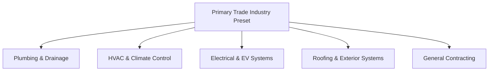

# TradeFlow — Executive Product Guide & Architecture Blueprint

> **The Modern, High-Performance Operating System for Skilled Trade Businesses**  
> *Built for Plumbers, HVAC Specialists, Electricians, Roofers, and General Contractors.*

---

## 1. Executive Summary: What is TradeFlow?

**TradeFlow** is an all-in-one business management platform designed specifically for skilled trade businesses (plumbing, heating & air conditioning, electrical, roofing, and general contracting).

In simple terms:  
**TradeFlow takes a customer from their first phone call all the way to a paid invoice—in minutes, on any device, without ever typing the same thing twice.**

```
   [Customer Calls] 
          │
          ▼
   1. Quick Customer Entry  ──► (Saved to your private CRM in 5 seconds)
          │
          ▼
   2. Instant Smart Quote   ──► (Auto-priced with trade presets or AI)
          │
          ▼
   3. 1-Click Job Dispatch  ──► (Scheduled on the map & sent to field technician)
          │
          ▼
   4. Field Work Execution  ──► (Tech captures before/after photos, notes, signature)
          │
          ▼
   5. Instant Final Invoice ──► (1-click conversion; sends PDF + online payment link)
          │
          ▼
   [Paid in Full to Your Bank]
```

---

## 2. Why TradeFlow Exists: The Real-World Problem

Every day, trade business owners face an exhausting paperwork nightmare:

| The Old Way (Spreadsheets, Paper & Legacy Software) | The TradeFlow Way |
| :--- | :--- |
| **Lost Details**: Notes written on sticky notes or WhatsApp get forgotten. | **Unified Timeline**: Every note, photo, and part is linked directly to the job. |
| **Double & Triple Data Entry**: Typing info into a quote, re-typing into a job sheet, re-typing into an invoice. | **1-Click Forwarding**: A quote converts to a job, and a job converts to an invoice with 1 click. |
| **Clunky Legacy Systems**: Tools like ServiceTitan or Jobber cost hundreds per month, require weeks of training, and freeze on mobile. | **Lightning Fast & Modern**: Built with ultra-clean modern technology, instant loading, and zero training required. |
| **Siloed by Trade**: Buying one app for plumbing and needing another for roofing or general contracting. | **5 Built-In Trade Presets**: Switch between Plumbing, HVAC, Electrical, Roofing, and General Contracting with 1 tap. |
| **Chasing Payments**: Waiting 30 to 60 days for checks in the mail. | **Instant Online Pay**: Homeowners get a mobile-ready link with a live credit card checkout button and downloadable PDF. |

---

## 3. What Has Been Built & Implemented (The Complete Feature Tour)

TradeFlow is not a basic prototype—it is a production-hardened platform verified by **1,714 automated test suites**. Here is what is built and running:

### A. The Universal 4-Stage Traceability Pipeline
Trade business owners always know the exact status of every dollar in their pipeline. Every screen displays a live 4-stage visual progress tracker:

```
[ Step 1: Quote Sent/Accepted ] ──► [ Step 2: Job Scheduled ] ──► [ Step 3: Work Completed ] ──► [ Step 4: Invoice Paid ]
```
- **Instant Bi-Directional Linking**: On an invoice, click to immediately see the original technician job sheet or initial quote.
- **Color-Coded Status Badges**: Live indicators reveal whether a job is `Draft`, `Sent`, `Scheduled`, `In Progress`, `Completed`, or `Paid`.

---

### B. Instant Smart Quotes & AI Scoping
- **1-Tap Quick Presets**: Built-in pricing for common repairs (e.g., Water Heater replacement, EV Charger install, Shingle repair, Drain snaking).
- **AI Estimator**: Built-in AI option lets owners describe a job in plain English (e.g., *"Emergency leak under kitchen sink with water damage"*) and automatically generates line items, estimated labor hours, material costs, and terms.
- **Client Digital Approval**: Generates a private, secure web link. The homeowner can open it on their smartphone, review line items, and tap **"Accept Proposal"** without needing an account.
- **Executive PDF Export**: Creates high-resolution PDF proposals complete with business branding, terms, warranties, and QR verification codes.

---

### C. Live Field Technician Mobile Hub
Technicians in the field work from their smartphones with a tailored, high-visibility interface:
- **Daily Route & Schedule**: Technicians see their assigned jobs with addresses, customer contacts, and job descriptions.
- **Before & After Photo Proof**: Upload on-site photos before starting work and after completing repairs for proof of quality.
- **Digital Sign-Off Pad**: Homeowners sign directly on the technician's phone screen with their finger.
- **Field Billables & Parts Tracking**: Technicians can add extra parts used on the fly (e.g., *"20ft copper pipe + brass valve"*). When the owner generates the invoice, **all technician field items are automatically included**.

---

### D. 1-Click Invoicing & Direct Stripe Payments
- **Zero Calculation Errors**: TradeFlow uses an integer-based financial calculation engine. Taxes, discounts, line items, and partial payments are accurate down to the cent with zero rounding glitches.
- **Automated Invoice Generation**: When a job is completed, 1 click pulls customer info, technician notes, photos, and parts into a finalized invoice.
- **Direct Online Card Payments**: Powered by Stripe. Homeowners tap a link, enter their card or Apple Pay, and funds flow directly into the trade owner's bank account.
- **Partial & Offline Payments**: Record cash, checks, or bank transfers with automatic balance due calculation.

---

### E. Multi-Trade Industry Engine (5 Trade Presets in 1 App)
Unlike single-purpose tools, TradeFlow allows any business to specialize instantly. In **Settings**, clicking a trade instantly updates the entire platform:



1. **Plumbing & Drainage (`Plumbing Pro`)**: Pre-loaded with water heaters, emergency pipe leaks, motorized snaking, faucet replacements, and toilet rebuilds.
2. **HVAC & Climate (`HVAC Certified`)**: Pre-loaded with AC diagnostics, R-410A eco-refrigerant recharges, smart thermostats, and blower motor replacements.
3. **Electrical & EV (`Master Electrician`)**: Pre-loaded with 200A breaker panel upgrades, Level 2 EV fast charger installations, and whole-home surge protection.
4. **Roofing Systems (`Roofing Specialist`)**: Pre-loaded with roof integrity inspections, architectural shingle emergency patches, seamless gutter cleanouts, and flashing reseals.
5. **General Contracting (`General Contractor`)**: Pre-loaded with drywall repair, door hanging, tile backsplashes, and trim weatherization.

*When switched, trade titles, badges, invoice lines, quote warranties, and navigation indicators update automatically across the entire app.*

---

### F. BYOK (Bring Your Own Key) & Client Independence
TradeFlow gives trade owners total independence and privacy:
- **Private OpenAI Key**: Use your own AI account for unlimited job scoping and quote generation.
- **Custom Verified Email (Resend)**: Send emails to customers directly from your own company domain (e.g., `quotes@apexproplumbing.com`) instead of a generic no-reply address.
- **Custom Stripe Merchant**: Connect your own Stripe account for direct deposits.
- **Database-Backed Zero-FS Architecture**: Runs seamlessly in the cloud with zero file-system crashes and instantaneous sub-millisecond caching.

---

### G. Executive Pictorial Dashboard & Fleet Radar
- **Revenue Performance**: Real-time tracking of monthly revenue, unpaid invoices, overdue balances, and quote win-rates.
- **Interactive Calendar & Gantt Dispatch**: Visual triage shows technician workload across the week to prevent double-booking.
- **Quick Command Palette (`Cmd + K`)**: Jump anywhere in the app, search customers, or create a quote with keyboard shortcuts.
- **Global Themes & Multi-Language**: Includes Dark Mode, Light Mode, and Colorful Luxury Mode, with full translations in English, Spanish, French, and German, and multi-currency formatting ($ USD, € EUR, £ GBP, $ CAD, $ AUD).

---

## 4. Key Market Strengths & Unique Selling Points (USPs)

Why will trade owners choose TradeFlow over billion-dollar legacy competitors?

| Feature | Legacy Competitors (Jobber, ServiceTitan) | TradeFlow Advantage |
| :--- | :--- | :--- |
| **Speed & Setup Time** | Days or weeks of complex onboarding calls and setup fees. | **Ready in 30 seconds**. Sign up and send your first quote immediately. |
| **Mobile Experience** | Clunky desktop websites scaled down to phone screens. | **Mobile-First Luxury UI**. Designed to feel like a high-end native smartphone app. |
| **Traceability** | Disconnected tabs; hard to see if a quote ever got invoiced. | **Universal 4-Stage Progress Tracker** on every document. |
| **Technician Workflow** | Separate complex technician portals with high subscription fees. | **Built-in Tech Hub** with digital signatures, live notes, and photo uploads. |
| **Multi-Trade Flexibility** | Built for one trade or requires expensive custom enterprise tiers. | **5 Trade Presets in 1 click** (Plumbing, HVAC, Electrical, Roofing, General). |
| **Data Ownership & BYOK** | Trapped inside the platform's proprietary email and AI servers. | **BYOK Independence**. Plug in your own OpenAI, Resend, and Stripe keys. |
| **Pricing** | $150 to $500+ / month plus per-user fees. | **$39 / month** with 14-day free trial and zero per-seat penalties. |

---

## 5. Architectural Quality & Engineering Standards

TradeFlow is built on top of state-of-the-art modern cloud architecture:

```
┌────────────────────────────────────────────────────────┐
│             Next.js 15 App Router Frontend             │
│   (React Server Components + Mobile-Optimized Tailwind)│
└───────────────────────────┬────────────────────────────┘
                            │ Server Actions & HTTPS
┌───────────────────────────▼────────────────────────────┐
│              Enterprise Service Layer                  │
│  QuoteService • JobService • InvoiceService • AIService│
│         TenantIntegrationService • BillingService      │
└───────────────────────────┬────────────────────────────┘
                            │ Secure Service-Role Queries
┌───────────────────────────▼────────────────────────────┐
│          Supabase PostgreSQL Database Engine           │
│   Row Level Security (RLS) • Multi-Tenant Isolation    │
│   Cryptographic Public Tokens • Real-Time Audit Logs   │
└────────────────────────────────────────────────────────┘
```

- **Bulletproof Multi-Tenant Isolation**: Every organization's customers, jobs, and invoices are strictly isolated using PostgreSQL Row-Level Security (RLS). No business can ever see another business's data.
- **Serverless Resilience**: Re-architected with zero local filesystem dependencies (`zero-fs`), ensuring reliable execution across global cloud lambdas without `ENOENT` crashes.
- **1,714 Passing Unit & Integration Tests**: Covers authentication, role-based permissions (Owner, Admin, Technician), math accuracy, PDF generation, and customer quote approval.

---

## 6. Summary for Non-Technical Stakeholders & Investors

> **TradeFlow turns the chaotic daily operations of skilled trade businesses into a smooth, automated revenue engine.**  
> - Contractors win more jobs because their quotes look professional and send in seconds.  
> - Technicians eliminate disputes because customer signatures and before/after photos are recorded on site.  
> - Business owners get paid faster because invoices generate with one click and allow instant credit card checkout.

**The result:** Less paperwork, faster cash flow, and a software experience trade professionals actually enjoy using every single day.
