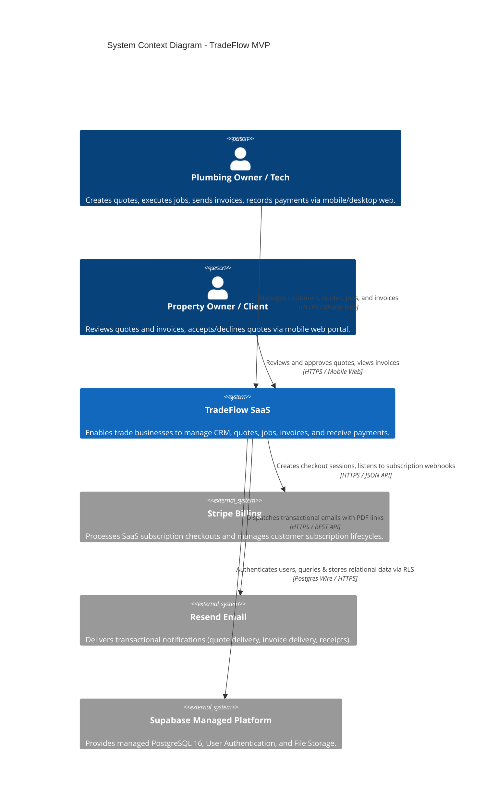
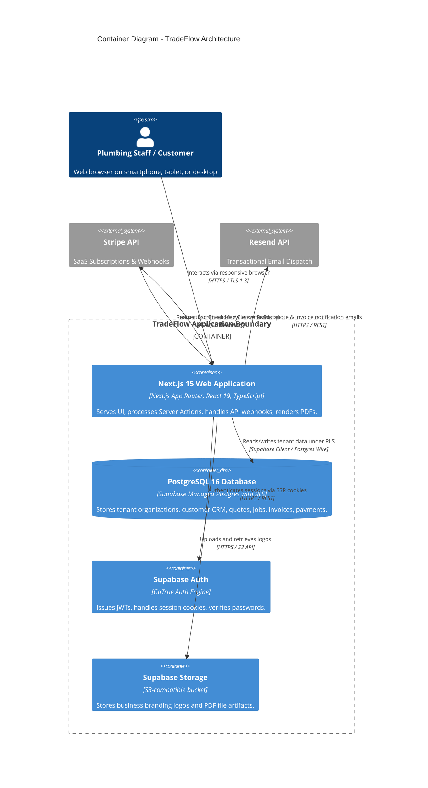
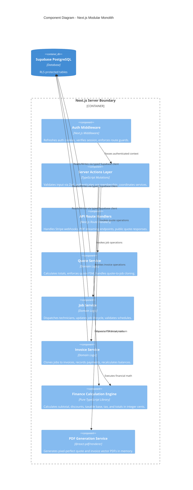
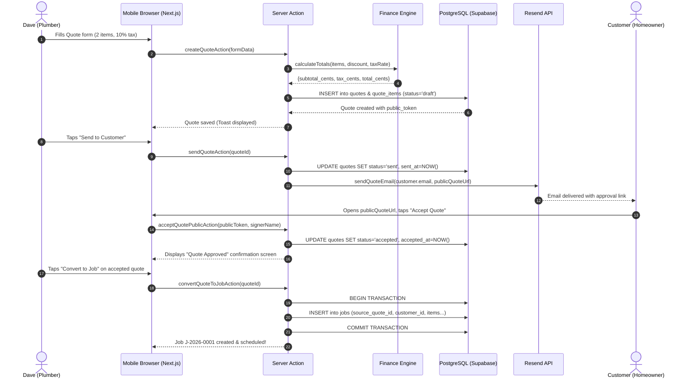
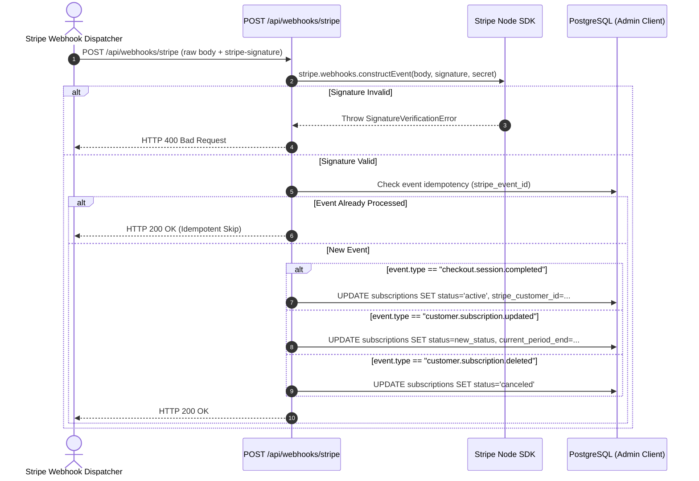

# System Architecture Document — TradeFlow
**Version:** 1.0  
**Pattern:** Modular Monolith on Managed Cloud & Serverless Infrastructure  
**Target:** 8-Day Production Build  

---

## 1. Architectural Style & Tenets

TradeFlow is architected as a **cloud-native, multi-tenant modular monolith**. For an 8-day engineering sprint executed by a solo developer and AI coding agents, microservices introduce unacceptable distributed systems overhead (network latency, RPC contracts, eventual consistency bugs, dual writes, separate CI/CD pipelines, and multi-service deployment failures).

Instead, TradeFlow enforces modular domain isolation inside a single, type-safe Next.js codebase, delegating infrastructure complexity to world-class managed providers:

```
+-----------------------------------------------------------------------------------------+
|                                    TRADEFLOW RUNTIME                                    |
|                                                                                         |
|   +---------------------------------------------------------------------------------+   |
|   |                        Next.js 15 App Router on Vercel                          |   |
|   |   +-------------------+  +--------------------+  +--------------------------+   |   |
|   |   |  Server Actions   |  |   Route Handlers   |  | React Server Components  |   |   |
|   |   +---------+---------+  +---------+----------+  +------------+-------------+   |   |
|   |             |                      |                          |                 |   |
|   |             +----------------------+--------------------------+                 |   |
|   |                                    |                                            |   |
|   |                         [Domain Services Layer]                                 |   |
|   |                         (Strict Module Boundaries)                              |   |
|   +------------------------------------+--------------------------------------------+   |
|                                        |                                                |
+----------------------------------------|------------------------------------------------+
                                         |
                       +-----------------+-----------------+
                       |                                   |
                       v                                   v
+------------------------------------+   +------------------------------------+
|        Supabase Managed Cloud      |   |       External SaaS Services       |
|  - PostgreSQL 16 (RLS Enforced)    |   |  - Stripe (Billing / SCA)          |
|  - Supabase Auth (JWT & Cookies)   |   |  - Resend (Transactional Email)    |
|  - Supabase Storage (Logos/Assets) |   |                                    |
+------------------------------------+   +------------------------------------+
```

### Core Architecture Tenets:
1. **Multi-Tenancy by Default:** Every record belongs to an `organization_id`. PostgreSQL Row Level Security (RLS) is the non-negotiable security foundation.
2. **Zero Floating-Point Math:** All currency values are strictly stored and computed as 64-bit integer cents.
3. **No Duplicate Entry:** Pipeline progression ($\text{Quote} \rightarrow \text{Job} \rightarrow \text{Invoice}$) performs deep data cloning to eradicate repetitive typing for trade operators.
4. **Serverless & Managed:** Zero VMs to patch, zero Docker containers to orchestrate, zero Kubernetes clusters to configure.
5. **Mobile Ergonomics First:** UI is architected around thumb-friendly 44px tap targets and immediate offline-friendly responsive layouts.

---

## 2. C4 Model Architectural Diagrams

### 2.1 Level 1: System Context Diagram



---

### 2.2 Level 2: Container Diagram



---

### 2.3 Level 3: Component Diagram (Next.js Application Internals)



---

## 3. Multi-Tenant Isolation Pattern

TradeFlow implements **Shared Database, Shared Schema Multi-Tenancy with Row Level Security (RLS)**:

```
                            [ Incoming HTTP Request ]
                                        |
                                        v
                    [ Next.js Middleware / Auth Verification ]
                                        |
                       Resolves active organization_id
                                        |
                                        v
                       [ Server Action / Service Layer ]
                     Passes session JWT to Supabase Client
                                        |
                                        v
                       [ PostgreSQL Execution Engine ]
                                        |
                 +---------------------------------------------+
                 |            PostgreSQL Row Level Security     |
                 |  Filters ALL rows by active organization_id |
                 +---------------------------------------------+
                                        |
                 +----------------------+----------------------+
                 |                                             |
                 v                                             v
        [ Organization A Data ]                       [ Organization B Data ]
        (Isolated & Protected)                        (Isolated & Protected)
```

### Defense-in-Depth Enforcement:
1. **Layer 1 (Application Middleware):** Validates authentication session and confirms the user belongs to at least one valid organization.
2. **Layer 2 (Service Layer / Server Action):** Explicitly injects the authenticated `organization_id` into query filters and mutation payloads.
3. **Layer 3 (Database Row Level Security):** Absolute safeguard. If application logic has a defect or omitted filter, PostgreSQL rejects access unless the current user has a matching membership in `organization_members` for that row.

---

## 4. End-to-End Request-Response Lifecycles

### 4.1 Authenticated Business Flow: Quote $\rightarrow$ Job $\rightarrow$ Invoice


---

### 4.2 Stripe Subscription Webhook Lifecycle


---

## 5. Technology Stack Matrix & Trade-Off Analysis

| Decision | Alternative Considered | Chosen Approach | Architectural Trade-Off Analysis |
| :--- | :--- | :--- | :--- |
| **System Architecture** | Microservices (Auth service, Job service, Billing service) | **Modular Monolith** | Microservices would guarantee failure on an 8-day timeline due to distributed tracing, network boundaries, and deployment complexity. Modular monolith ensures zero-latency internal calls, shared type safety, and atomic transactions. |
| **Database Access** | Prisma ORM | **Supabase Client + Postgres Typed SQL** | Prisma client requires binary engine compilation that bloats serverless cold starts on Vercel and has historically complicated Postgres RLS session variable propagation. Direct typed Supabase client is lightweight, native, and directly passes JWT context to RLS policies. |
| **PDF Generation** | Headless Chrome (Puppeteer / Playwright) | **@react-pdf/renderer** | Headless Chromium exceeds Vercel's standard function size limits (50MB) and incurs 2-5s cold starts. React PDF generates pure vector PDFs in-memory in $< 400\text{ms}$ with zero binary dependencies. |
| **Scheduling Engine** | External Cron Fleet (Temporal / BullMQ) | **Vercel Cron / Webhook triggers** | Avoids spinning up dedicated Redis or worker VPS instances. Standard status transitions (e.g. marking overdue invoices) run via daily Vercel Cron jobs invoking secure internal route handlers. |

---

## 6. Disaster Recovery, Backup & Fault Tolerance

1. **Database Resilience:** Supabase Point-in-Time Recovery (PITR) enabled; automated daily full backups retained for 30 days.
2. **Stateless Compute:** All Next.js compute nodes on Vercel are stateless and replicated globally. Node failures trigger instantaneous traffic rerouting to healthy serverless instances.
3. **Data Loss Invariants:** Quotes and invoices are append-only state machines. Voiding or cancelling records preserves historical rows with timestamps; hard deletion is prohibited for any financial document with recorded payments.
