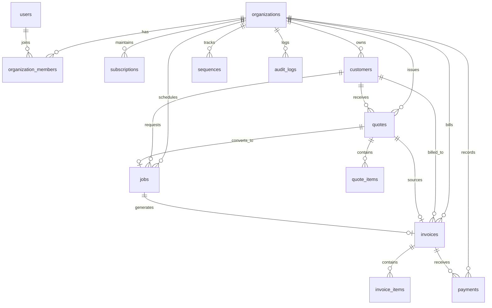

# Database Schema & Migrations Specification — TradeFlow
**Version:** 1.0  
**Database Engine:** PostgreSQL 16 (Supabase Managed)  
**Security Model:** Row-Level Security (RLS) on 100% of Tenant Entities  
**Monetary Standard:** Integer minor units (`BIGINT` cents/pence)  

---

## 1. Schema Overview & Entity-Relationship Diagram



---

## 2. PostgreSQL DDL (Data Definition Language)

### 2.1 Extensions & Utility Functions

```sql
-- Enable necessary extensions
CREATE EXTENSION IF NOT EXISTS "uuid-ossp";
CREATE EXTENSION IF NOT EXISTS "pgcrypto";

-- Automatic timestamp update trigger function
CREATE OR REPLACE FUNCTION update_updated_at_column()
RETURNS TRIGGER AS $$
BEGIN
    NEW.updated_at = NOW();
    RETURN NEW;
END;
$$ LANGUAGE plpgsql;

-- Security context helper: checks if auth.uid() is an active member of organization
CREATE OR REPLACE FUNCTION is_org_member(org_id UUID)
RETURNS BOOLEAN AS $$
BEGIN
    RETURN EXISTS (
        SELECT 1 FROM organization_members
        WHERE organization_id = org_id
          AND user_id = auth.uid()
    );
END;
$$ LANGUAGE plpgsql SECURITY DEFINER;

-- Security context helper: checks if auth.uid() has owner or admin role
CREATE OR REPLACE FUNCTION is_org_admin(org_id UUID)
RETURNS BOOLEAN AS $$
BEGIN
    RETURN EXISTS (
        SELECT 1 FROM organization_members
        WHERE organization_id = org_id
          AND user_id = auth.uid()
          AND role IN ('owner', 'admin')
    );
END;
$$ LANGUAGE plpgsql SECURITY DEFINER;
```

---

### 2.2 Organizations & Membership Tables

```sql
-- 1. Organizations
CREATE TABLE organizations (
    id UUID PRIMARY KEY DEFAULT gen_random_uuid(),
    name VARCHAR(255) NOT NULL,
    slug VARCHAR(100) NOT NULL UNIQUE,
    email VARCHAR(255),
    phone VARCHAR(50),
    address_line1 VARCHAR(255),
    address_line2 VARCHAR(255),
    city VARCHAR(100),
    state VARCHAR(100),
    postal_code VARCHAR(50),
    country VARCHAR(2) NOT NULL DEFAULT 'US', -- 'US', 'GB', 'AU'
    currency VARCHAR(3) NOT NULL DEFAULT 'USD', -- 'USD', 'GBP', 'AUD'
    timezone VARCHAR(50) NOT NULL DEFAULT 'America/New_York',
    tax_rate_basis_points INTEGER NOT NULL DEFAULT 0, -- e.g. 1000 = 10.00%
    invoice_terms TEXT DEFAULT 'Payment due within 14 days of receipt.',
    logo_url TEXT,
    created_at TIMESTAMPTZ NOT NULL DEFAULT NOW(),
    updated_at TIMESTAMPTZ NOT NULL DEFAULT NOW()
);

CREATE TRIGGER trg_organizations_updated_at
BEFORE UPDATE ON organizations
FOR EACH ROW EXECUTE FUNCTION update_updated_at_column();

-- 2. User Profiles (Synced with Supabase auth.users)
CREATE TABLE users (
    id UUID PRIMARY KEY REFERENCES auth.users(id) ON DELETE CASCADE,
    full_name VARCHAR(255) NOT NULL,
    email VARCHAR(255) NOT NULL UNIQUE,
    phone VARCHAR(50),
    avatar_url TEXT,
    created_at TIMESTAMPTZ NOT NULL DEFAULT NOW(),
    updated_at TIMESTAMPTZ NOT NULL DEFAULT NOW()
);

CREATE TRIGGER trg_users_updated_at
BEFORE UPDATE ON users
FOR EACH ROW EXECUTE FUNCTION update_updated_at_column();

-- 3. Organization Memberships & Roles
CREATE TYPE user_role AS ENUM ('owner', 'admin', 'technician');

CREATE TABLE organization_members (
    id UUID PRIMARY KEY DEFAULT gen_random_uuid(),
    organization_id UUID NOT NULL REFERENCES organizations(id) ON DELETE CASCADE,
    user_id UUID NOT NULL REFERENCES users(id) ON DELETE CASCADE,
    role user_role NOT NULL DEFAULT 'technician',
    created_at TIMESTAMPTZ NOT NULL DEFAULT NOW(),
    updated_at TIMESTAMPTZ NOT NULL DEFAULT NOW(),
    CONSTRAINT uq_org_member UNIQUE (organization_id, user_id)
);

CREATE INDEX idx_org_members_user ON organization_members(user_id);
CREATE INDEX idx_org_members_org ON organization_members(organization_id);

CREATE TRIGGER trg_org_members_updated_at
BEFORE UPDATE ON organization_members
FOR EACH ROW EXECUTE FUNCTION update_updated_at_column();
```

---

### 2.3 Subscriptions & Sequences

```sql
-- 4. SaaS Subscriptions
CREATE TYPE subscription_status AS ENUM ('trialing', 'active', 'past_due', 'canceled', 'incomplete');

CREATE TABLE subscriptions (
    id UUID PRIMARY KEY DEFAULT gen_random_uuid(),
    organization_id UUID NOT NULL UNIQUE REFERENCES organizations(id) ON DELETE CASCADE,
    stripe_customer_id VARCHAR(100) UNIQUE,
    stripe_subscription_id VARCHAR(100) UNIQUE,
    plan_id VARCHAR(100) NOT NULL DEFAULT 'starter_monthly',
    status subscription_status NOT NULL DEFAULT 'trialing',
    trial_start TIMESTAMPTZ NOT NULL DEFAULT NOW(),
    trial_end TIMESTAMPTZ NOT NULL DEFAULT (NOW() + INTERVAL '14 days'),
    current_period_start TIMESTAMPTZ,
    current_period_end TIMESTAMPTZ,
    cancel_at_period_end BOOLEAN NOT NULL DEFAULT FALSE,
    created_at TIMESTAMPTZ NOT NULL DEFAULT NOW(),
    updated_at TIMESTAMPTZ NOT NULL DEFAULT NOW()
);

CREATE TRIGGER trg_subscriptions_updated_at
BEFORE UPDATE ON subscriptions
FOR EACH ROW EXECUTE FUNCTION update_updated_at_column();

-- 5. Sequential Numbering Generators
CREATE TABLE sequences (
    organization_id UUID NOT NULL REFERENCES organizations(id) ON DELETE CASCADE,
    entity_type VARCHAR(20) NOT NULL, -- 'quote', 'job', 'invoice'
    last_val BIGINT NOT NULL DEFAULT 0,
    PRIMARY KEY (organization_id, entity_type)
);

-- Atomic sequence generator function
CREATE OR REPLACE FUNCTION fn_next_sequence(p_org_id UUID, p_entity_type TEXT)
RETURNS TEXT AS $$
DECLARE
    v_next_val BIGINT;
    v_year TEXT;
    v_prefix TEXT;
BEGIN
    v_year := TO_CHAR(NOW(), 'YYYY');
    
    CASE p_entity_type
        WHEN 'quote' THEN v_prefix := 'Q';
        WHEN 'job' THEN v_prefix := 'J';
        WHEN 'invoice' THEN v_prefix := 'INV';
        ELSE RAISE EXCEPTION 'Invalid entity type: %', p_entity_type;
    END CASE;

    INSERT INTO sequences (organization_id, entity_type, last_val)
    VALUES (p_org_id, p_entity_type, 1)
    ON CONFLICT (organization_id, entity_type)
    DO UPDATE SET last_val = sequences.last_val + 1
    RETURNING last_val INTO v_next_val;

    RETURN v_prefix || '-' || v_year || '-' || LPAD(v_next_val::TEXT, 4, '0');
END;
$$ LANGUAGE plpgsql SECURITY DEFINER;
```

---

### 2.4 Customer CRM Table

```sql
-- 6. Customers
CREATE TABLE customers (
    id UUID PRIMARY KEY DEFAULT gen_random_uuid(),
    organization_id UUID NOT NULL REFERENCES organizations(id) ON DELETE CASCADE,
    first_name VARCHAR(100) NOT NULL,
    last_name VARCHAR(100) NOT NULL,
    company_name VARCHAR(255),
    email VARCHAR(255),
    phone VARCHAR(50) NOT NULL,
    address_line1 VARCHAR(255) NOT NULL,
    address_line2 VARCHAR(255),
    city VARCHAR(100) NOT NULL,
    state VARCHAR(100) NOT NULL,
    postal_code VARCHAR(50) NOT NULL,
    country VARCHAR(2) NOT NULL DEFAULT 'US',
    notes TEXT,
    created_at TIMESTAMPTZ NOT NULL DEFAULT NOW(),
    updated_at TIMESTAMPTZ NOT NULL DEFAULT NOW()
);

CREATE INDEX idx_customers_org_created ON customers(organization_id, created_at DESC);
CREATE INDEX idx_customers_search ON customers(organization_id, first_name, last_name, phone);

CREATE TRIGGER trg_customers_updated_at
BEFORE UPDATE ON customers
FOR EACH ROW EXECUTE FUNCTION update_updated_at_column();
```

---

### 2.5 Quotes & Line Items

```sql
-- 7. Quotes
CREATE TYPE quote_status AS ENUM ('draft', 'sent', 'accepted', 'rejected', 'expired');

CREATE TABLE quotes (
    id UUID PRIMARY KEY DEFAULT gen_random_uuid(),
    organization_id UUID NOT NULL REFERENCES organizations(id) ON DELETE CASCADE,
    customer_id UUID NOT NULL REFERENCES customers(id) ON DELETE RESTRICT,
    quote_number VARCHAR(50) NOT NULL,
    status quote_status NOT NULL DEFAULT 'draft',
    issue_date DATE NOT NULL DEFAULT CURRENT_DATE,
    expiry_date DATE NOT NULL DEFAULT (CURRENT_DATE + INTERVAL '30 days'),
    subtotal_cents BIGINT NOT NULL DEFAULT 0,
    discount_cents BIGINT NOT NULL DEFAULT 0,
    tax_cents BIGINT NOT NULL DEFAULT 0,
    total_cents BIGINT NOT NULL DEFAULT 0,
    notes TEXT,
    terms TEXT,
    public_token VARCHAR(64) NOT NULL UNIQUE DEFAULT encode(gen_random_bytes(32), 'hex'),
    sent_at TIMESTAMPTZ,
    accepted_at TIMESTAMPTZ,
    accepted_by_name VARCHAR(255),
    accepted_ip VARCHAR(50),
    rejected_at TIMESTAMPTZ,
    rejection_reason TEXT,
    created_by UUID REFERENCES users(id) ON DELETE SET NULL,
    created_at TIMESTAMPTZ NOT NULL DEFAULT NOW(),
    updated_at TIMESTAMPTZ NOT NULL DEFAULT NOW(),
    CONSTRAINT uq_org_quote_num UNIQUE (organization_id, quote_number)
);

CREATE INDEX idx_quotes_org_status ON quotes(organization_id, status);
CREATE INDEX idx_quotes_customer ON quotes(customer_id);
CREATE INDEX idx_quotes_token ON quotes(public_token);

CREATE TRIGGER trg_quotes_updated_at
BEFORE UPDATE ON quotes
FOR EACH ROW EXECUTE FUNCTION update_updated_at_column();

-- 8. Quote Line Items
CREATE TABLE quote_items (
    id UUID PRIMARY KEY DEFAULT gen_random_uuid(),
    organization_id UUID NOT NULL REFERENCES organizations(id) ON DELETE CASCADE,
    quote_id UUID NOT NULL REFERENCES quotes(id) ON DELETE CASCADE,
    description TEXT NOT NULL,
    quantity NUMERIC(10, 2) NOT NULL DEFAULT 1.00 CHECK (quantity > 0),
    unit_price_cents BIGINT NOT NULL DEFAULT 0 CHECK (unit_price_cents >= 0),
    taxable BOOLEAN NOT NULL DEFAULT TRUE,
    total_cents BIGINT NOT NULL DEFAULT 0,
    sort_order INTEGER NOT NULL DEFAULT 0,
    created_at TIMESTAMPTZ NOT NULL DEFAULT NOW()
);

CREATE INDEX idx_quote_items_quote ON quote_items(quote_id, sort_order ASC);
CREATE INDEX idx_quote_items_org ON quote_items(organization_id);
```

---

### 2.6 Jobs & Scheduling

```sql
-- 9. Jobs
CREATE TYPE job_status AS ENUM ('scheduled', 'in_progress', 'completed', 'cancelled');

CREATE TABLE jobs (
    id UUID PRIMARY KEY DEFAULT gen_random_uuid(),
    organization_id UUID NOT NULL REFERENCES organizations(id) ON DELETE CASCADE,
    customer_id UUID NOT NULL REFERENCES customers(id) ON DELETE RESTRICT,
    source_quote_id UUID REFERENCES quotes(id) ON DELETE SET NULL,
    job_number VARCHAR(50) NOT NULL,
    title VARCHAR(255) NOT NULL,
    description TEXT,
    status job_status NOT NULL DEFAULT 'scheduled',
    scheduled_start TIMESTAMPTZ,
    scheduled_end TIMESTAMPTZ,
    assigned_to_user_id UUID REFERENCES users(id) ON DELETE SET NULL,
    address_line1 VARCHAR(255) NOT NULL,
    address_line2 VARCHAR(255),
    city VARCHAR(100) NOT NULL,
    state VARCHAR(100) NOT NULL,
    postal_code VARCHAR(50) NOT NULL,
    internal_notes TEXT,
    started_at TIMESTAMPTZ,
    completed_at TIMESTAMPTZ,
    created_by UUID REFERENCES users(id) ON DELETE SET NULL,
    created_at TIMESTAMPTZ NOT NULL DEFAULT NOW(),
    updated_at TIMESTAMPTZ NOT NULL DEFAULT NOW(),
    CONSTRAINT uq_org_job_num UNIQUE (organization_id, job_number)
);

CREATE INDEX idx_jobs_org_status ON jobs(organization_id, status);
CREATE INDEX idx_jobs_assigned ON jobs(assigned_to_user_id, status);
CREATE INDEX idx_jobs_schedule ON jobs(organization_id, scheduled_start);

CREATE TRIGGER trg_jobs_updated_at
BEFORE UPDATE ON jobs
FOR EACH ROW EXECUTE FUNCTION update_updated_at_column();
```

---

### 2.7 Invoices, Items & Offline Payments

```sql
-- 10. Invoices
CREATE TYPE invoice_status AS ENUM ('draft', 'sent', 'paid', 'overdue', 'void');

CREATE TABLE invoices (
    id UUID PRIMARY KEY DEFAULT gen_random_uuid(),
    organization_id UUID NOT NULL REFERENCES organizations(id) ON DELETE CASCADE,
    customer_id UUID NOT NULL REFERENCES customers(id) ON DELETE RESTRICT,
    source_job_id UUID REFERENCES jobs(id) ON DELETE SET NULL,
    source_quote_id UUID REFERENCES quotes(id) ON DELETE SET NULL,
    invoice_number VARCHAR(50) NOT NULL,
    status invoice_status NOT NULL DEFAULT 'draft',
    issue_date DATE NOT NULL DEFAULT CURRENT_DATE,
    due_date DATE NOT NULL DEFAULT (CURRENT_DATE + INTERVAL '14 days'),
    subtotal_cents BIGINT NOT NULL DEFAULT 0,
    discount_cents BIGINT NOT NULL DEFAULT 0,
    tax_cents BIGINT NOT NULL DEFAULT 0,
    total_cents BIGINT NOT NULL DEFAULT 0,
    amount_paid_cents BIGINT NOT NULL DEFAULT 0,
    balance_due_cents BIGINT NOT NULL DEFAULT 0,
    notes TEXT,
    terms TEXT,
    public_token VARCHAR(64) NOT NULL UNIQUE DEFAULT encode(gen_random_bytes(32), 'hex'),
    sent_at TIMESTAMPTZ,
    paid_at TIMESTAMPTZ,
    voided_at TIMESTAMPTZ,
    created_by UUID REFERENCES users(id) ON DELETE SET NULL,
    created_at TIMESTAMPTZ NOT NULL DEFAULT NOW(),
    updated_at TIMESTAMPTZ NOT NULL DEFAULT NOW(),
    CONSTRAINT uq_org_invoice_num UNIQUE (organization_id, invoice_number),
    CONSTRAINT chk_positive_totals CHECK (total_cents >= 0 AND amount_paid_cents >= 0)
);

CREATE INDEX idx_invoices_org_status ON invoices(organization_id, status);
CREATE INDEX idx_invoices_customer ON invoices(customer_id);
CREATE INDEX idx_invoices_token ON invoices(public_token);

CREATE TRIGGER trg_invoices_updated_at
BEFORE UPDATE ON invoices
FOR EACH ROW EXECUTE FUNCTION update_updated_at_column();

-- 11. Invoice Line Items
CREATE TABLE invoice_items (
    id UUID PRIMARY KEY DEFAULT gen_random_uuid(),
    organization_id UUID NOT NULL REFERENCES organizations(id) ON DELETE CASCADE,
    invoice_id UUID NOT NULL REFERENCES invoices(id) ON DELETE CASCADE,
    description TEXT NOT NULL,
    quantity NUMERIC(10, 2) NOT NULL DEFAULT 1.00 CHECK (quantity > 0),
    unit_price_cents BIGINT NOT NULL DEFAULT 0 CHECK (unit_price_cents >= 0),
    taxable BOOLEAN NOT NULL DEFAULT TRUE,
    total_cents BIGINT NOT NULL DEFAULT 0,
    sort_order INTEGER NOT NULL DEFAULT 0,
    created_at TIMESTAMPTZ NOT NULL DEFAULT NOW()
);

CREATE INDEX idx_invoice_items_invoice ON invoice_items(invoice_id, sort_order ASC);
CREATE INDEX idx_invoice_items_org ON invoice_items(organization_id);

-- 12. Recorded Payments
CREATE TYPE payment_method AS ENUM ('credit_card', 'bank_transfer', 'cash', 'check', 'other');

CREATE TABLE payments (
    id UUID PRIMARY KEY DEFAULT gen_random_uuid(),
    organization_id UUID NOT NULL REFERENCES organizations(id) ON DELETE CASCADE,
    invoice_id UUID NOT NULL REFERENCES invoices(id) ON DELETE CASCADE,
    amount_cents BIGINT NOT NULL CHECK (amount_cents > 0),
    payment_date DATE NOT NULL DEFAULT CURRENT_DATE,
    payment_method payment_method NOT NULL DEFAULT 'credit_card',
    reference_number VARCHAR(100),
    notes TEXT,
    recorded_by UUID REFERENCES users(id) ON DELETE SET NULL,
    created_at TIMESTAMPTZ NOT NULL DEFAULT NOW()
);

CREATE INDEX idx_payments_org ON payments(organization_id, payment_date);
CREATE INDEX idx_payments_invoice ON payments(invoice_id);

-- 13. Audit Logs
CREATE TABLE audit_logs (
    id UUID PRIMARY KEY DEFAULT gen_random_uuid(),
    organization_id UUID NOT NULL REFERENCES organizations(id) ON DELETE CASCADE,
    entity_type VARCHAR(50) NOT NULL,
    entity_id UUID NOT NULL,
    action VARCHAR(50) NOT NULL,
    actor_id UUID REFERENCES users(id) ON DELETE SET NULL,
    changes_json JSONB,
    created_at TIMESTAMPTZ NOT NULL DEFAULT NOW()
);

CREATE INDEX idx_audit_logs_org_entity ON audit_logs(organization_id, entity_type, entity_id);
```

---

## 3. PostgreSQL Row-Level Security (RLS) Policies

```sql
-- Enable RLS on ALL application tables
ALTER TABLE organizations ENABLE ROW LEVEL SECURITY;
ALTER TABLE users ENABLE ROW LEVEL SECURITY;
ALTER TABLE organization_members ENABLE ROW LEVEL SECURITY;
ALTER TABLE subscriptions ENABLE ROW LEVEL SECURITY;
ALTER TABLE customers ENABLE ROW LEVEL SECURITY;
ALTER TABLE sequences ENABLE ROW LEVEL SECURITY;
ALTER TABLE quotes ENABLE ROW LEVEL SECURITY;
ALTER TABLE quote_items ENABLE ROW LEVEL SECURITY;
ALTER TABLE jobs ENABLE ROW LEVEL SECURITY;
ALTER TABLE invoices ENABLE ROW LEVEL SECURITY;
ALTER TABLE invoice_items ENABLE ROW LEVEL SECURITY;
ALTER TABLE payments ENABLE ROW LEVEL SECURITY;
ALTER TABLE audit_logs ENABLE ROW LEVEL SECURITY;

-- 1. Organizations Policies
CREATE POLICY "Members can view their own organization"
ON organizations FOR SELECT
USING (is_org_member(id));

CREATE POLICY "Owners can update their organization"
ON organizations FOR UPDATE
USING (is_org_admin(id));

-- 2. Users Policies
CREATE POLICY "Users can view members of same organization"
ON users FOR SELECT
USING (
    id = auth.uid() OR
    EXISTS (
        SELECT 1 FROM organization_members m1
        JOIN organization_members m2 ON m1.organization_id = m2.organization_id
        WHERE m1.user_id = auth.uid() AND m2.user_id = users.id
    )
);

CREATE POLICY "Users can update their own profile"
ON users FOR UPDATE
USING (id = auth.uid());

-- 3. Organization Members Policies
CREATE POLICY "Members can view team membership in their org"
ON organization_members FOR SELECT
USING (is_org_member(organization_id));

CREATE POLICY "Admins can invite and manage members"
ON organization_members FOR ALL
USING (is_org_admin(organization_id));

-- 4. Subscriptions Policies
CREATE POLICY "Members can view subscription status"
ON subscriptions FOR SELECT
USING (is_org_member(organization_id));

-- 5. Customers Policies
CREATE POLICY "Org members can view customers"
ON customers FOR SELECT
USING (is_org_member(organization_id));

CREATE POLICY "Admins and Owners can insert/update customers"
ON customers FOR ALL
USING (is_org_admin(organization_id));

-- 6. Quotes & Items Policies
CREATE POLICY "Org members can view quotes"
ON quotes FOR SELECT
USING (is_org_member(organization_id));

CREATE POLICY "Admins and Owners can manage quotes"
ON quotes FOR ALL
USING (is_org_admin(organization_id));

CREATE POLICY "Org members can view quote items"
ON quote_items FOR SELECT
USING (is_org_member(organization_id));

CREATE POLICY "Admins and Owners can manage quote items"
ON quote_items FOR ALL
USING (is_org_admin(organization_id));

-- 7. Jobs Policies
CREATE POLICY "Members can view jobs they belong to or are assigned"
ON jobs FOR SELECT
USING (
    is_org_admin(organization_id) OR
    (is_org_member(organization_id) AND assigned_to_user_id = auth.uid())
);

CREATE POLICY "Admins can manage jobs"
ON jobs FOR ALL
USING (is_org_admin(organization_id));

CREATE POLICY "Assigned technicians can update job status and notes"
ON jobs FOR UPDATE
USING (assigned_to_user_id = auth.uid())
WITH CHECK (assigned_to_user_id = auth.uid());

-- 8. Invoices & Items Policies
CREATE POLICY "Org members can view invoices"
ON invoices FOR SELECT
USING (is_org_admin(organization_id));

CREATE POLICY "Admins can manage invoices"
ON invoices FOR ALL
USING (is_org_admin(organization_id));

CREATE POLICY "Org members can view invoice items"
ON invoice_items FOR SELECT
USING (is_org_admin(organization_id));

CREATE POLICY "Admins can manage invoice items"
ON invoice_items FOR ALL
USING (is_org_admin(organization_id));

-- 9. Payments Policies
CREATE POLICY "Admins can view and record payments"
ON payments FOR ALL
USING (is_org_admin(organization_id));

-- 10. Audit Logs Policies
CREATE POLICY "Admins can view audit logs"
ON audit_logs FOR SELECT
USING (is_org_admin(organization_id));
```

---

## 4. User Creation Webhook Trigger

```sql
-- Automatically insert row into public.users when Supabase auth signs up a user
CREATE OR REPLACE FUNCTION public.handle_new_user()
RETURNS TRIGGER AS $$
BEGIN
    INSERT INTO public.users (id, email, full_name)
    VALUES (
        NEW.id,
        NEW.email,
        COALESCE(NEW.raw_user_meta_data->>'full_name', SPLIT_PART(NEW.email, '@', 1))
    );
    RETURN NEW;
END;
$$ LANGUAGE plpgsql SECURITY DEFINER;

CREATE TRIGGER on_auth_user_created
AFTER INSERT ON auth.users
FOR EACH ROW EXECUTE FUNCTION public.handle_new_user();
```
