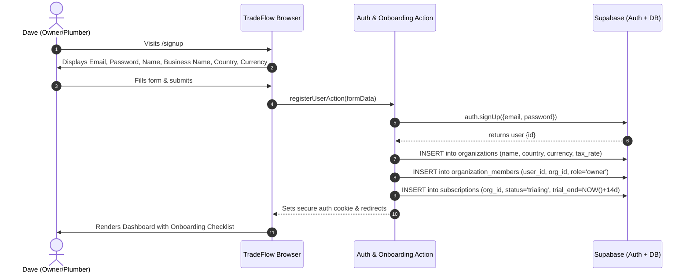
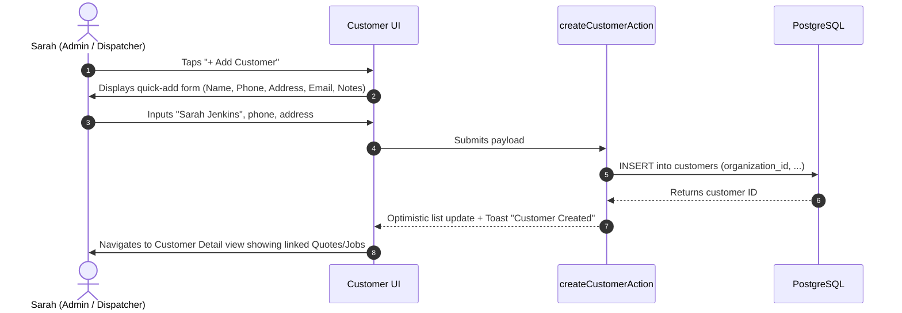
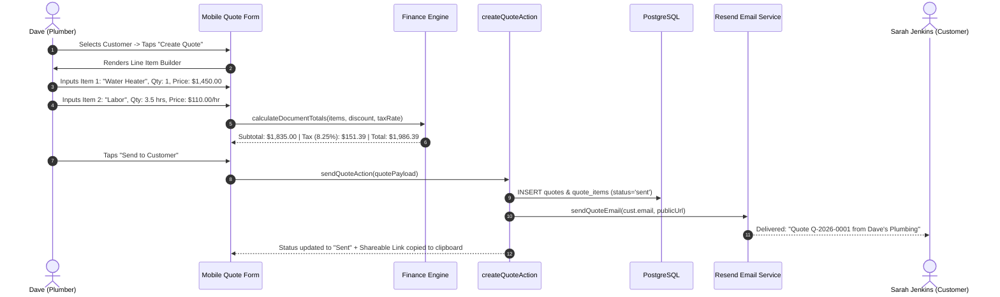
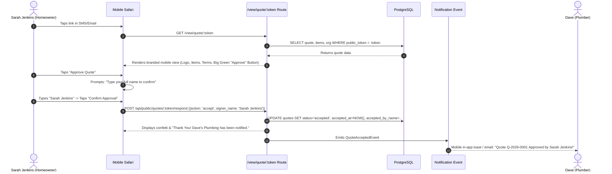
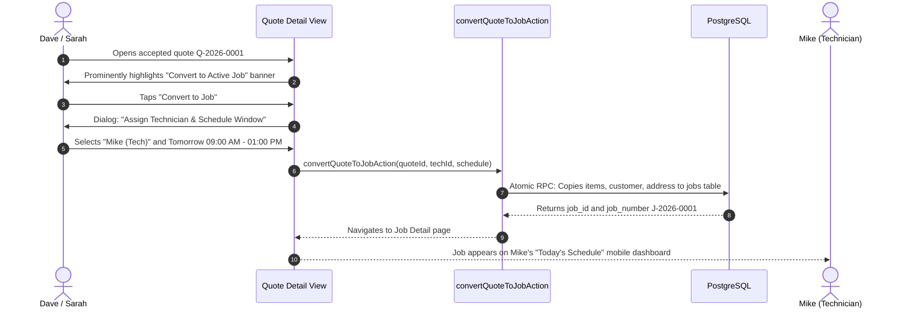
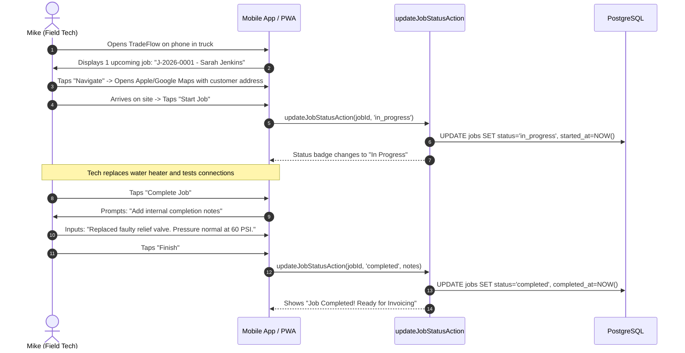
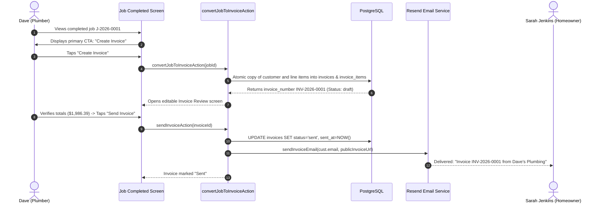
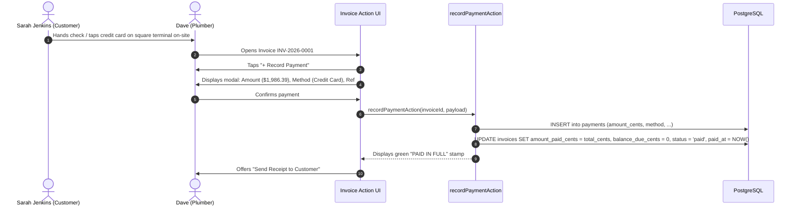
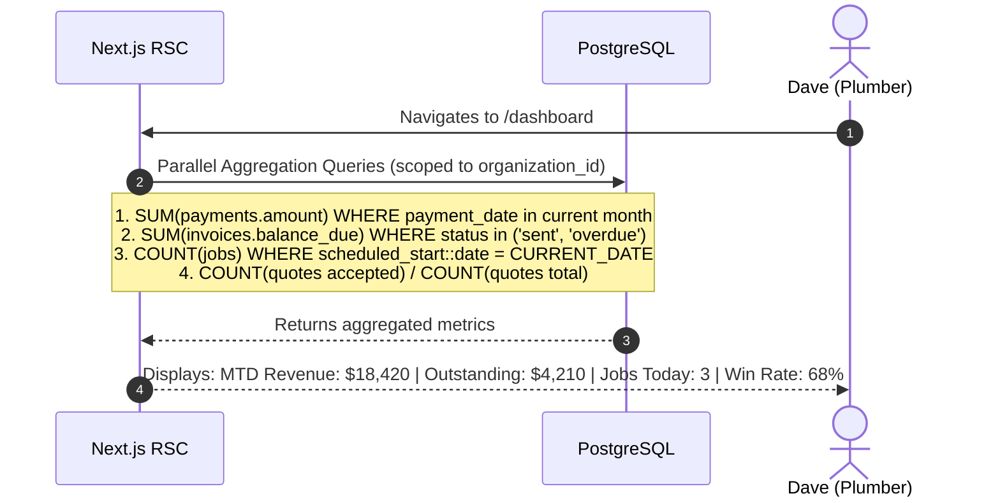
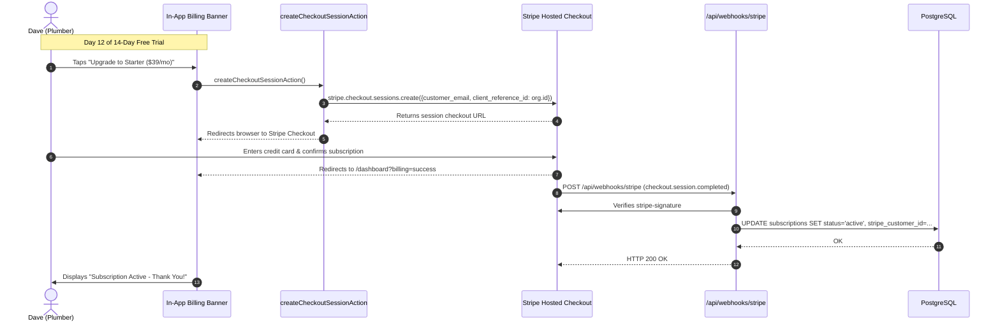

# User & System Flows — TradeFlow
**Version:** 1.0  
**Target Personas:** Owner ("Dave"), Admin ("Sarah"), Technician ("Mike"), Customer ("Sarah Jenkins")  
**Design Principle:** Frictionless, thumb-friendly mobile interactions, zero redundant data entry  

---

## 1. Flow 1: Business Registration & Workspace Onboarding

### Onboarding Checklist Screen State:
1. Business Profile Configured (Completed)
2. Add Your First Customer (Pending CTA)
3. Send Your First Quote (Locked until customer added)

---

## 2. Flow 2: Customer Creation & Directory Management

---

## 3. Flow 3: Quote Creation, Preview & Customer Delivery

---

## 4. Flow 4: Customer Public Quote Review & Digital Approval

---

## 5. Flow 5: 1-Click Quote-to-Job Conversion & Dispatch

---

## 6. Flow 6: Mobile Technician Field Execution

---

## 7. Flow 7: 1-Click Job-to-Invoice Conversion & Delivery

---

## 8. Flow 8: Customer Invoice Review & Offline Payment Recording

---

## 9. Flow 9: Operational Dashboard Telemetry Updates

---

## 10. Flow 10: SaaS Subscription Checkout & Webhook Lifecycle

