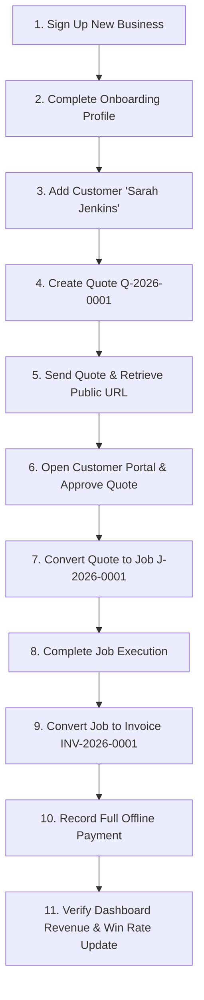

# Test Plan & Quality Assurance Strategy — TradeFlow
**Version:** 1.0  
**Testing Frameworks:** Vitest (Unit/Integration) & Playwright (End-to-End)  
**Target Coverage:** Core Financial Math (100%), State Transitions (100%), Golden Path E2E (100%)  

---

## 1. Testing Philosophy & Test Pyramid

For an 8-day MVP build executed by a solo developer and AI coding agents, testing must focus on **high-leverage risk surfaces**: financial correctness, tenant data isolation, state machine invariants, and the golden revenue-generating user journey.

```
                  / \
                 /   \
                / E2E \       Playwright: Golden Path, Multi-Tenant Boundary,
               / Tests \      Public Portal Approval (3-5 comprehensive tests)
              /---------\
             /           \
            / Integration \   Vitest + Supabase Local: RLS Tenant Isolation,
           /     Tests     \  Server Actions, Stripe Webhook Handlers
          /-----------------\
         /                   \
        /     Unit Tests      \ Vitest: Financial Calculation Engine, FSMs,
       /                       \ Zod Input Validation, Number Sequences
      /-------------------------\
```

---

## 2. Unit Test Specifications

### 2.1 Financial Calculation Engine Test Suite (`test/unit/calculator.test.ts`)
| Test Case ID | Test Scenario | Input Data | Expected Output |
| :--- | :--- | :--- | :--- |
| **TC-CALC-01** | Standard multi-item calculation without discount or tax | 2 items: (qty: 2, price: 5000), (qty: 1.5, price: 10000) | Subtotal: 25000 cents ($250.00), Tax: 0, Total: 25000 cents |
| **TC-CALC-02** | Decimal quantity precision with half-up rounding | qty: 1.333, price: 10000 | Item Total: 13330 cents (exact integer rounding) |
| **TC-CALC-03** | Flat discount application | Subtotal: 10000 cents, Flat Discount: 2500 cents | Subtotal: 10000, Discount: 2500, Total: 7500 cents |
| **TC-CALC-04** | Flat discount exceeding subtotal | Subtotal: 5000 cents, Flat Discount: 10000 cents | Discount clamped to 5000 cents, Total: 0 cents |
| **TC-CALC-05** | Percentage discount using basis points | Subtotal: 20000 cents, Discount: 1500 bps (15.00%) | Discount: 3000 cents, Net: 17000 cents |
| **TC-CALC-06** | Tax calculation with mixed taxable & non-taxable items | Item 1 (taxable): 10000 cents, Item 2 (non-taxable): 5000 cents, Tax: 1000 bps (10.00%) | Taxable Base: 10000 cents, Tax: 1000 cents, Total: 16000 cents |
| **TC-CALC-07** | Pro-rated discount across taxable items | Subtotal: 20000 cents (10000 taxable, 10000 exempt), Flat Discount: 4000 cents, Tax: 1000 bps | Discount: 4000 cents, Taxable Base: 8000 cents, Tax: 800 cents, Total: 16800 cents |
| **TC-CALC-08** | Zero quantity or negative price defense | qty: -1 or price: -500 | Validation fails; throws Zod parsing error |

---

### 2.2 State Machine Transition Test Suite (`test/unit/state-machines.test.ts`)
| Test Case ID | Entity | Initial State | Trigger Event | Expected Result |
| :--- | :--- | :--- | :--- | :--- |
| **TC-FSM-01** | Quote | `draft` | `SEND` | Transitions to `sent`; sets `sent_at` timestamp. |
| **TC-FSM-02** | Quote | `draft` | `ACCEPT` | **Rejected.** Quotes cannot be accepted before being sent. |
| **TC-FSM-03** | Quote | `sent` | `ACCEPT` | Transitions to `accepted`; locks line items. |
| **TC-FSM-04** | Quote | `accepted` | `CONVERT_JOB` | Generates Job; Quote remains `accepted`. |
| **TC-FSM-05** | Quote | `accepted` | `UPDATE_ITEMS` | **Rejected.** Accepted quotes are immutable. |
| **TC-FSM-06** | Job | `scheduled` | `COMPLETE` | **Rejected.** Job must transition to `in_progress` before completion. |
| **TC-FSM-07** | Job | `in_progress` | `COMPLETE` | Transitions to `completed`; sets `completed_at`. |
| **TC-FSM-08** | Invoice | `draft` | `SEND` | Transitions to `sent`; sets `sent_at`. |
| **TC-FSM-09** | Invoice | `sent` | `PAYMENT_FULL` | Transitions to `paid`; sets `paid_at`, `balance_due = 0`. |
| **TC-FSM-10** | Invoice | `paid` | `UPDATE_ITEMS` | **Rejected.** Paid invoices are strictly immutable. |
| **TC-FSM-11** | Invoice | `paid` | `VOID` | **Rejected.** Cannot void an invoice with positive payments recorded. |

---

## 3. Integration Test Specifications

### 3.1 PostgreSQL Row-Level Security (RLS) Test Suite (`test/integration/rls.test.ts`)
Using local Supabase test instance with two provisioned organizations: **Org A** (`User A`) and **Org B** (`User B`).

| Test Case ID | Test Description | Execution Steps | Expected Outcome |
| :--- | :--- | :--- | :--- |
| **TC-RLS-01** | Customer Cross-Tenant Read | `User A` executes `SELECT * FROM customers` | Returns only Org A customers; zero Org B customers returned. |
| **TC-RLS-02** | Customer Cross-Tenant Write | `User A` attempts `INSERT INTO customers (organization_id) VALUES (Org B ID)` | Query rejected with PostgreSQL RLS violation error. |
| **TC-RLS-03** | Quote Cross-Tenant Read | `User B` attempts `SELECT * FROM quotes WHERE id = (Org A Quote ID)` | Query returns 0 rows (empty set). |
| **TC-RLS-04** | Technician Role RBAC Isolation | Authenticated as `User Tech A` (role: `technician`), attempt `SELECT * FROM invoices` | Returns 0 rows (Technicians do not have invoice read policy). |
| **TC-RLS-05** | Technician Assigned Job Access | `User Tech A` queries `SELECT * FROM jobs` | Returns only jobs where `assigned_to_user_id = User Tech A ID`. |
| **TC-RLS-06** | Technician Job Status Mutation | `User Tech A` updates status of assigned job from `scheduled` to `in_progress` | Mutation succeeds; `updated_at` refreshed. |
| **TC-RLS-07** | Technician Job Hijacking Defense | `User Tech A` attempts to update a job assigned to `User Tech B` | Mutation rejected with RLS policy check failure. |

---

### 3.2 Stripe Webhook Integration Test Suite (`test/integration/webhooks.test.ts`)
| Test Case ID | Webhook Event | Payload Condition | Expected Action |
| :--- | :--- | :--- | :--- |
| **TC-WH-01** | `checkout.session.completed` | Valid signature; matching `client_reference_id` | `subscriptions` record updated to `status = 'active'`, `stripe_customer_id` stored. Returns HTTP 200. |
| **TC-WH-02** | Any event | Invalid `stripe-signature` header | Throws `SignatureVerificationError`. Returns HTTP 400 Bad Request. |
| **TC-WH-03** | `customer.subscription.deleted` | Valid signature; existing subscription | `subscriptions.status` updated to `'canceled'`. Returns HTTP 200. |
| **TC-WH-04** | Duplicate event | Identical `event.id` processed twice | Idempotency handler detects prior event; skips mutation and returns HTTP 200. |

---

## 4. End-to-End (E2E) Test Specifications (Playwright)

### 4.1 E2E-01: The Core Golden Path
**File:** `tests/e2e/golden-path.spec.ts`  
**Objective:** Verify the entire business lifecycle from owner registration to payment collection.



**Step-by-Step Assertions:**
1. Navigate to `/signup`, submit valid details. Verify redirection to `/dashboard`.
2. Navigate to `/customers/new`, enter "Sarah Jenkins", phone "555-0199", address "742 Evergreen Terrace". Save and assert customer detail page renders.
3. Click "New Quote". Add 2 line items: Water Heater ($1,450.00), Labor ($385.00). Assert computed total equals $1,986.39 with tax.
4. Click "Send Quote". Copy public token link.
5. In a secondary unauthenticated browser context, open the public quote URL. Assert business name and line items are visible.
6. Type "Sarah Jenkins" and click "Approve Quote". Verify approval confirmation banner.
7. Return to authenticated owner context. Refresh quote page. Verify status is `accepted`.
8. Click "Convert to Job". Select tomorrow's date. Click "Create Job". Verify job `J-2026-0001` created in status `scheduled`.
9. Update job status to `in_progress`, then `completed` with completion note.
10. Click "Create Invoice". Verify invoice `INV-2026-0001` created in status `draft` with total $1,986.39.
11. Click "Record Payment". Input $1,986.39 via Credit Card. Submit.
12. Assert invoice status transitions to `paid` with balance due $0.00.
13. Navigate to `/dashboard`. Assert MTD Revenue displays $1,986.39 and Win Rate shows 100%.

---

### 4.2 E2E-02: Multi-Tenant Data Leakage & Direct Object Reference (BOLA/IDOR) Test
**File:** `tests/e2e/tenant-isolation.spec.ts`
1. Session 1 registers **Plumber A** (`org_a`) and creates Customer A and Quote A.
2. Session 2 registers **Plumber B** (`org_b`).
3. Session 2 navigates directly to `/quotes/[quote_a_id]`.
4. Assert application renders `404 Not Found` (never `403 Forbidden` to prevent resource ID enumeration).
5. Session 2 attempts to call `getQuoteAction(quote_a_id)`.
6. Assert action returns error `{ code: "RESOURCE_NOT_FOUND" }`.

---

### 4.3 E2E-03: Public Approval Portal Mobile Ergonomics Test
**File:** `tests/e2e/public-portal.spec.ts`
1. Emulate mobile viewport (iPhone 14: $390 \times 844$).
2. Open public quote portal link.
3. Verify tap targets for "Approve Quote" and "Decline Quote" are $\ge 44\text{px} \times 44\text{px}$.
4. Click "Decline Quote". Assert modal prompts for optional feedback reason.
5. Submit rejection reason: "Found another plumber with earlier availability."
6. Assert quote status in owner dashboard updates to `rejected` with recorded reason.

---

## 5. Continuous Integration (CI/CD) Pipeline

GitHub Actions Workflow (`.github/workflows/ci.yml`):
1. **Lint & Typecheck:** `npm run lint && tsc --noEmit`
2. **Unit & Integration Tests:** `npm run test:unit && npm run test:integration`
3. **Database Migration Verification:** Starts local Supabase Docker container, applies all migrations in `supabase/migrations/`, verifies RLS policies.
4. **End-to-End Tests:** Executes Playwright test suite against local Next.js preview server.
5. **Vercel Production Deployment Gate:** Triggered strictly if all 4 steps pass.
